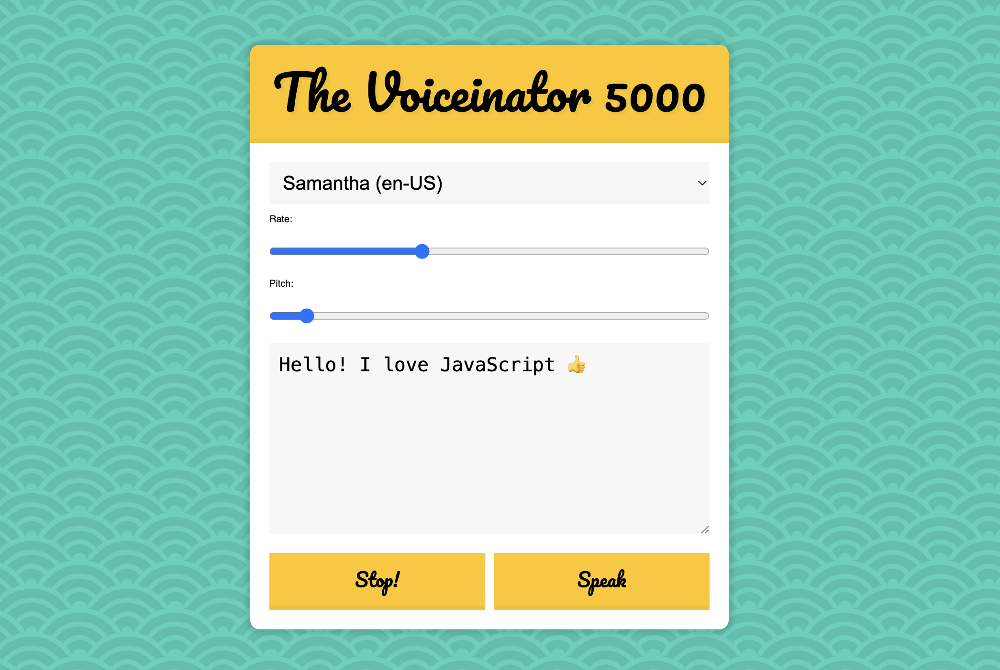

# Speech_Synthesis

This is a 30-days javascript grinding  
js30 [https://github.com/ningh98/js30]  
23. Speech_Synthesis [https://github.com/ningh98/Speech_Synthesis]

## Table of contents

- [Overview](#overview)
  - [Screenshot](#screenshot)
  - [Links](#links)
- [My process](#my-process)
  - [Built with](#built-with)
  - [What I learned](#what-i-learned)


## Overview

The provided  document creates a simple web page featuring an interface that allows users to input text and control its speech synthesis using various settings such as voice selection, rate, and pitch.

### Screenshot




### Links

- Live Site URL: [https://ningh98.github.io/Speech_Synthesis/]

## My process

### Built with

- HTML
- CSS
- Javascript


### What I learned


```js

const msg = new SpeechSynthesisUtterance();
  let voices = [];
  const voicesDropdown = document.querySelector('[name="voice"]');
  const options = document.querySelectorAll('[type="range"], [name="text"]');
  const speakButton = document.querySelector('#speak');
  const stopButton = document.querySelector('#stop');
  msg.text = document.querySelector('[name="text"]').value
  function populateVoices(){
    voices = this.getVoices()
    const voiceOption = voices
      .filter(voice => voice.lang.includes('en'))
      .map(voice => `<option value="${voice.name}">${voice.name} (${voice.lang})</ option>`)
      .join('')
      voicesDropdown.innerHTML = voiceOption
  }

  function setVoice(){
    msg.voice = voices.find(voice => voice.name === this.value)
    toggle()
  }

  function toggle(startOver = true){
    speechSynthesis.cancel()
    if (startOver){
      speechSynthesis.speak(msg)
    }
   
  }

  function setOption(){
    console.log(this.name, this.value)
    msg[this.name] = this.value
    toggle()
  }
  speechSynthesis.addEventListener('voiceschanged', populateVoices)
  voicesDropdown.addEventListener('change', setVoice)
  options.forEach(option => option.addEventListener('change', setOption))
  speakButton.addEventListener('click', toggle)
  stopButton.addEventListener('click', () => toggle(false))
```


